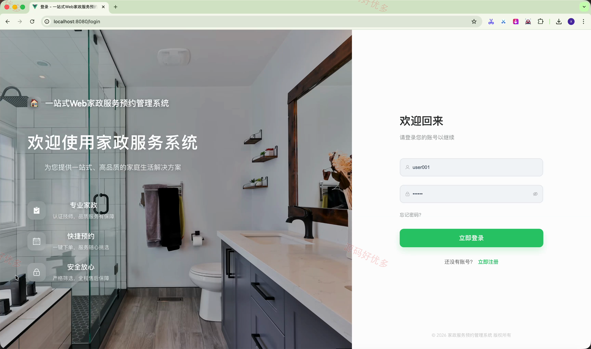
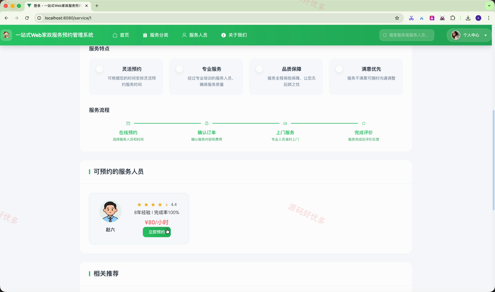
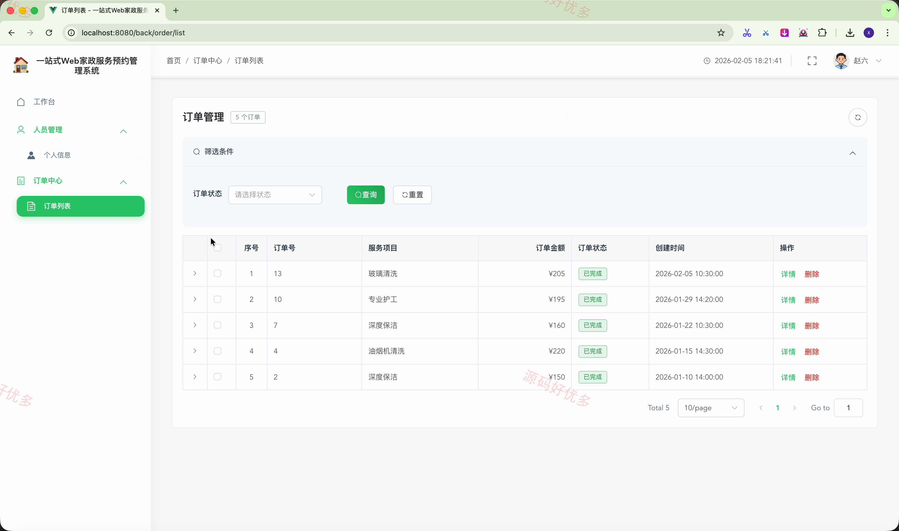
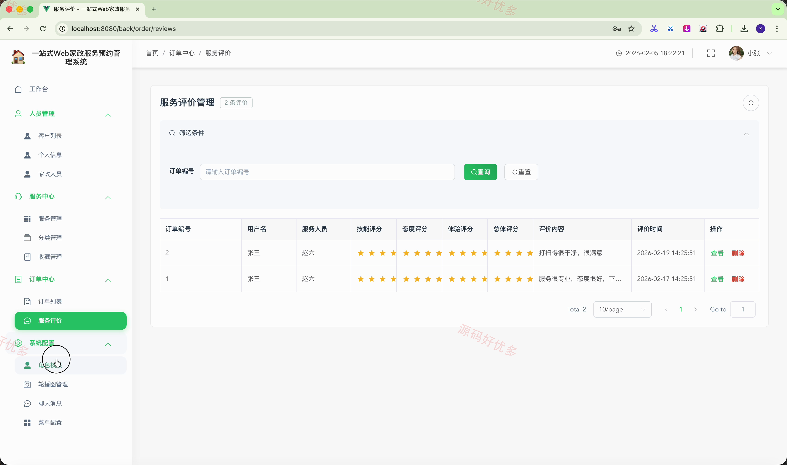
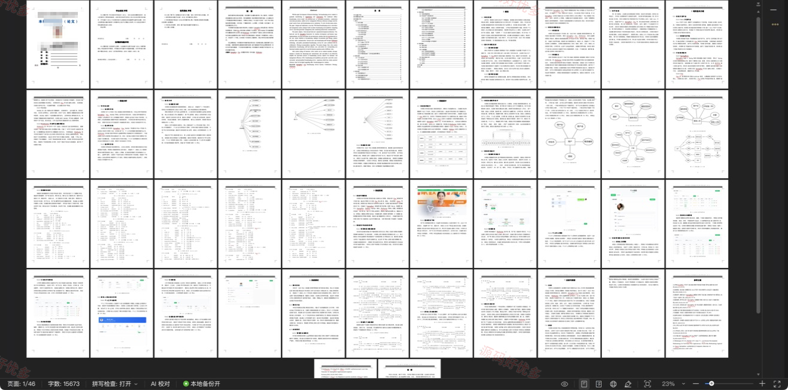

# springbootA638D-
springbootA638D 一站式Web家政服务预约管理系统
## 源码问题查看主页咨询

### 一、关键词
家政服务预约、家政人员管理、服务订单、服务评价

### 二、作品包含
源码+数据库+万字设计文档+PPT+全套环境和工具资源+本地部署教程

### 三、项目技术
前端技术： Html、Css、Js、Vue3.2、Element-Plus
后端技术：Java、SpringBoot3.2.0、MyBatis-Plus

### 四、运行环境（以下版本亲测，其他版本兼容性请自行测试）
开发工具：IDEA/eclipse + VSCODE

数据库：MySQL5.7+（共15张表）

数据库管理工具：Navicat10以上版本

环境配置软件： JDK17 + Maven3.6.3

前端Nodejs：16+

浏览器：谷歌浏览器

### 五、项目介绍
项目编号：springbootA638D

一站式Web家政服务预约管理系统面向普通用户、家政人员和系统管理员，支持家政服务浏览与预约、订单处理、服务评价、人员与服务项目维护以及后台权限配置，形成从服务选择到预约履约和评价管理的完整业务流程。

角色：普通用户、家政人员、系统管理员

普通用户功能：家政服务分类浏览、服务项目查看、家政人员查看、在线预约下单、我的订单管理、服务收藏、浏览历史、个人资料维护。

家政人员功能：工作台数据统计、服务订单管理、个人信息维护。

系统管理员功能：工作台数据统计、客户与家政人员管理、服务项目与分类管理、收藏记录管理、订单与服务评价管理、角色与菜单权限管理、轮播图管理、聊天消息管理。

### 六、运行截图

